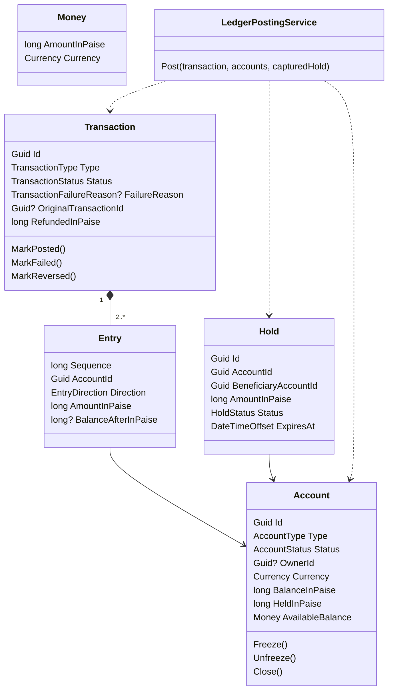
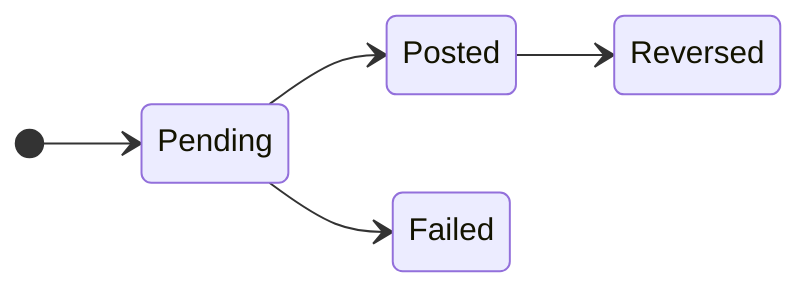
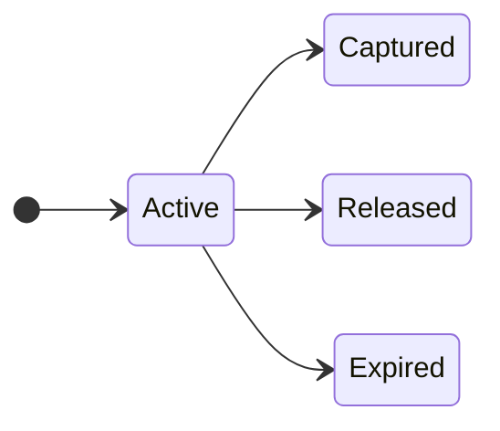

# Domain Model

This document describes the core types of the ledger, the rules each one enforces, and how a transaction is posted. It is based on [requirements.md](requirements.md).

## Sign convention

Every entry is a positive amount with a direction:

- **Credit** increases an account's balance.
- **Debit** decreases an account's balance.

`balance = sum(credits) - sum(debits)` for every account, customer or system. The entries of one transaction always have `sum(credits) == sum(debits)`, so the whole ledger always sums to zero.

System accounts can go negative. `Settlement` goes negative on deposits, because it represents money that came in from outside the platform. Customer wallets can never go below zero.

## Types

| Type | Kind | Purpose |
|---|---|---|
| `Money` | Value object | Amount in paise plus currency. Arithmetic refuses to mix currencies. |
| `Account` | Entity | A customer wallet or a system account. Holds a balance snapshot used for fast reads and locking. |
| `Transaction` | Aggregate root | One business operation and its entries. Owns the status lifecycle. |
| `Entry` | Entity inside `Transaction` | One debit or credit line. Never changed after it is written. |
| `Hold` | Entity | Money reserved on a wallet until it is captured, released or expires. |
| `LedgerPostingService` | Domain service | Applies a transaction to the accounts it touches. Lives outside both aggregates because posting changes several of them at once. |

## Enums

| Enum | Values |
|---|---|
| `Currency` | `INR` |
| `AccountType` | `CustomerWallet`, `Settlement`, `FeeRevenue`, `Suspense` |
| `AccountStatus` | `Active`, `Frozen`, `Closed` |
| `TransactionType` | `Deposit`, `Withdrawal`, `Transfer`, `HoldCapture`, `Refund`, `Reversal` |
| `TransactionStatus` | `Pending`, `Posted`, `Failed`, `Reversed` |
| `TransactionFailureReason` | `InsufficientFunds`, `AccountNotActive` |
| `EntryDirection` | `Debit`, `Credit` |
| `HoldStatus` | `Active`, `Captured`, `Released`, `Expired` |

## Lifecycles

Allowed transitions are declared once, inside `Transaction` and `Hold`. Any other transition throws.

## Rules and where they are enforced

| Rule | Enforced by |
|---|---|
| A transaction has at least two entries, all positive, all in one currency | `Transaction` constructor |
| Credits equal debits in every transaction | `Transaction` constructor, and a deferred constraint trigger in PostgreSQL |
| Entries are never updated or deleted | No setters in `Entry`, and a PostgreSQL trigger that rejects `UPDATE` and `DELETE` |
| Only allowed status transitions happen | `Transaction.TransitionTo`, `Hold.TransitionTo` |
| A customer wallet's available balance never goes below zero | `LedgerPostingService` (funds check), with accounts locked `FOR UPDATE` by the application |
| Money moves only between `Active` accounts | `LedgerPostingService` |
| A closed account has zero balance and no holds | `Account.Close` |
| System accounts cannot be frozen or closed | `Account` |
| Total refunds never exceed the original transfer amount | `Transaction.RecordRefund`, with the original transaction row locked |
| A transfer with refunds cannot be reversed, and a reversal cannot be reversed | `Transaction.EnsureCanBeReversed` |
| A hold can be captured once, for at most its amount, before it expires | `Hold.Capture` |

## Posting a transaction

1. The application opens a database transaction and locks every account the transaction touches, in ascending id order so two requests can never deadlock.
2. A `Transaction` is created in `Pending` with its entries. The constructor rejects unbalanced entries.
3. `LedgerPostingService.Post` checks that every account is `Active` and that each customer wallet has enough available balance for its debits in this transaction.
4. If a check fails, the transaction is marked `Failed` with a reason. Nothing is applied to the accounts, but the failed transaction is saved so the attempt is on record.
5. Otherwise each entry is applied to its account snapshot, records the account's balance after it, and the transaction is marked `Posted`.
6. Status changes raise domain events (`TransactionPosted`, `TransactionFailed`, `TransactionReversed`). They are written to the outbox table in the same database transaction.

Because every entry stores the balance after it was applied, a statement can show a running balance and "balance as of a date" is a single indexed lookup.
